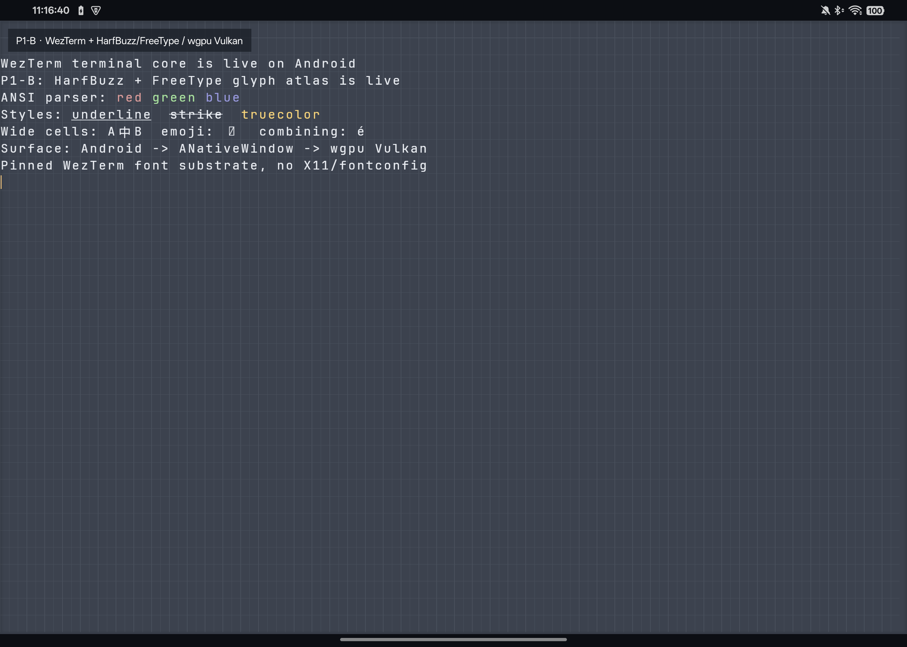

# WezTerm Android Native Client

这是一个面向 Android 的原生 WezTerm 客户端前端实验项目。目标是复用
WezTerm 的终端、字体、渲染与远程连接代码，同时使用标准 Android
`Activity`、`SurfaceView`、输入法和系统服务；不依赖 X11、Termux:X11、
proot 或 Linux 桌面环境。

> 当前已完成单 SSH 连接的可用闭环：真实远端 PTY 输出进入
> `wezterm-term`，并通过 HarfBuzz/FreeType 与 wgpu atlas 显示在 Android
> 原生 Surface。输入端已接入固定底部的应用内英文键盘和独立中文 IME
> 编辑框。真实 SSHMUX、持久远端标签页、安全分离与重新附着也已在 Android 15
> ARM64 真机完成闭环；触摸回滚、长按选择、系统剪贴板以及前后台恢复/自动重附着
> 也已完成实机闭环。

## 当前状态

P0、P1 与 P2 功能闭环已在 Android 15/API 35 ARM64 真机运行：

- Kotlin `SurfaceView` 提供 Android 原生 `Surface`；
- JNI 使用 `ANativeWindow_fromSurface` 获取并持有原生窗口；
- Rust `cdylib` 通过 `raw-window-handle` 创建 wgpu Vulkan Surface；
- Mali-G615 MC6 上已显示验证网格并完成实际 present；
- `Surface` 离开前台时销毁，回到前台后可在同一进程重新创建；
- Surface 是否可用只由 Vulkan 创建/Resize 结果决定，远端 PTY Resize 失败不会再让
  Kotlin 与 native renderer 状态失步；重复创建前会先释放旧 `ANativeWindow` producer；
- 远端连接使用固定 WezTerm revision 的 `wezterm-ssh`/libssh，不启动本地 PTY
  或 mux server；
- 已实测 host-key 确认、密码认证、`xterm-256color` PTY、远端输出和
  终端 resize；密码不持久化且不写入日志；
- 固定底部的应用内键盘提供英文、Shift 符号层、Ctrl/Alt/Esc/Tab、方向键，
  键盘参与纵向布局并缩小终端 Surface，不覆盖终端内容；
  Home/End/PgUp/PgDn/Ins/Del 和 F1–F12；
- 长特殊键行已折叠为右侧 4 列功能键区；中文只在独立编辑框内由
  系统 IME 组合，点击“发送”后才作为完整 UTF-8 字符串写入 PTY；
- APK 仅打包 `arm64-v8a`，ELF 和 APK 均通过 16 KB 静态对齐检查；
- 原生库动态依赖中没有 X11、XCB、Wayland 或 D-Bus。
- WezTerm 上游 revision 已固定为 `d2f3f05b38f26a872f4b0bfbb3d2eaa7bdfc1b0b`；
- `wezterm-term`、`termwiz`、cell/surface/escape parser 已交叉编译并链接进 APK；
- 固定字节流经过真实 WezTerm ANSI 状态机后，以只读 cell 快照交给 GPU；
- 主机测试覆盖 ANSI/TrueColor 属性、中文双宽单元格、组合字符和 terminal resize；
- 终端模型独立于 Android Surface，前后台重建不会重置该模型。
- 新增独立的 `wezterm-android-mux`：复用上游 `wezterm-client`、`mux` 和
  codec 45，可附着远端 WezTerm mux、读取 pane、切换/新建/关闭标签页；
- SSHMUX 的安全 Detach 与破坏性 Close tab 分开实现，后者在 Android UI 中必须
  二次确认；主机与 Android 真机均已验证 Detach 前后远端 pane ID 保持不变；
- Android 15 真机已通过应用私有免密 Ed25519 身份附着 codec 45，会话可新建、
  前后切换、关闭临时 tab，并在安全分离后重新附着原 pane；
- Android 专用 `dirs-next` 后端把上游所需 HOME/XDG 目录映射到应用私有存储，
  不依赖 Android UID 的 Unix passwd HOME，也不修改进程级 `HOME` 环境变量；
- SSHMUX 控制栏和状态栏同样参与纵向布局，不覆盖终端 Surface；
- 真机固定键盘布局下 Surface 与键盘在 `y=1266` 精确相接，远端尺寸稳定同步为
  `101x17`；
- 单指上下拖动和 fling 通过真实 `Pane::mouse_event` 向 SSHMUX 远端发送滚轮事件，
  由启用鼠标模式或 alternate screen 的 TUI 自行处理；双指上下拖动才浏览客户端
  WezTerm scrollback，状态栏显示距实时底部的行数，`↓ 实时` 可立即回到底部；
- 当另一个 WezTerm 客户端把远端 pane 保持为更高行数时，Android 视口会按自身
  `101x17` 尺寸从远端物理视口底部取行，避免提示符被裁掉，同时把隐藏行计入历史；
- 长按终端按词进入选择模式，拖动扩展选区；浮动操作栏支持复制、粘贴、选择当前
  可见屏幕和取消，复制/粘贴已接入 Android 系统剪贴板；
- Activity 进入后台不会主动 Detach：进程仍存活且 transport 健康时保持同一 SSHMUX
  连接和 pane；若上游 `ClientDomain` 已脱离但本地 session handle 仍存在，首次快照失败
  会触发一次安全清理和自动重附着，不再停留于“DETACH + 像素猫”的伪连接状态；
  若进程或连接丢失，回到前台/冷启动会使用已保存端点和应用私有密钥指数退避重附着；
  用户显式 Detach 会清除自动重附着标志；
- Android 设置 ↔ 客户端连续 3 轮切换已验证每轮 Surface 销毁、释放、重建和 present；
  键盘隐藏/显示连续 3 轮分别稳定同步本地与远端 `101x30` / `101x17`；
- 复用固定 WezTerm revision 内置的 FreeType 与 HarfBuzz 包，不引入桌面 fontconfig；
- APK 默认内嵌 `MesloLGS Nerd Font Mono Regular`，真机从 Android 系统字体
  加载 Noto Sans CJK SC fallback；
- Powerline/Nerd 私有区字形已通过 FreeType 测试，字体许可通知同时打包进 APK；
- HarfBuzz shaping、FreeType alpha rasterization 与 1024×1024 wgpu atlas 已实际 present；
- ANSI/TrueColor、下划线、删除线、CJK 双宽字符和组合字符已有截图证据；
- P1-A 的临时 `font8x8` 依赖已经移除。

详细证据和边界见 [P0 原生 Surface 验证记录](docs/P0_NATIVE_SURFACE_GATE.md)、
[P1-A WezTerm 终端核心验证记录](docs/P1A_TERMINAL_CORE_GATE.md)、
[P1-B 字体与 atlas 验证记录](docs/P1B_FONT_ATLAS_GATE.md)、
[P2 SSH 与移动输入记录](docs/P2_SSH_INPUT_GATE.md) 和
[P3 触摸、选择与剪贴板记录](docs/P3_TOUCH_CLIPBOARD_GATE.md)、
[P4-A SSHMUX 集成记录](docs/P4_SSHMUX_GATE.md) 以及
[实现路线图](docs/ROADMAP.md)。



## 构建

需要：

- Android SDK；
- Android NDK `28.2.13676358`；
- JDK 25（当前 Gradle 环境）；
- Rust stable；
- `aarch64-linux-android` target；
- `cargo-ndk`。

首次安装 Rust 侧工具：

```bash
rustup target add aarch64-linux-android
cargo install cargo-ndk --locked
```

项目已在 `.cargo/config.toml` 中配置清华 TUNA crates.io 稀疏索引，只作用于
本工作区，并让 Cargo 对 Git 依赖使用系统 Git。首次构建还会下载固定 revision
的 WezTerm 上游源码。确认 `local.properties` 中的 `sdk.dir` 正确后执行：

```bash
./gradlew :app:assembleDebug
```

Gradle 会自动调用 `cargo ndk`，无需先手工构建 Rust。生成的 APK 位于：

```text
app/build/outputs/apk/debug/app-debug.apk
```

安装并启动：

```bash
adb install -r app/build/outputs/apk/debug/app-debug.apk
adb shell am start -W -n com.example.wezterm_android/.MainActivity
```

Debug 构建如需应用私有免密身份，可为指定远端创建一把独立 Ed25519 key，并通过
`run-as` 放入应用私有目录：

```bash
./scripts/provision-debug-identity.sh USER@HOST [ADB_SERIAL]
```

脚本首次运行会调用 `ssh-copy-id`，可能询问一次远端密码。私钥只生成在当前用户的
数据目录并复制到 debug 应用私有目录，不进入 APK 或 Git；release 构建不会自动使用
这把 debug identity。

查看原生层关键日志：

```bash
adb logcat -s WezTermAndroid
```

单独验证不含 Android UI 的终端核心与字体 seam：

```bash
cargo test --manifest-path rust/Cargo.toml \
  -p wezterm-android-core -p wezterm-android-font \
  -p wezterm-android-ssh -p wezterm-android-mux --locked \
  -- --test-threads=1
```

## 代码边界

```text
MainActivity / TerminalSurfaceView / TerminalKeyboardView
  ├─ Android WindowInsets 与 Surface 生命周期
  ├─ 固定底部英文/符号键盘 + 独立系统 IME 编辑框
  ├─ SSH 端点、host-key 与一次性认证 UI
  ├─ 单指远端滚轮、双指回滚、长按选择与 Android 剪贴板
  ├─ SSHMUX 标签工具栏、安全分离与自动重附着
  └─ NativeBridge JNI
       ↓
wezterm-android-native (Rust cdylib)
  ├─ ANativeWindow 所有权
  ├─ raw-window-handle AndroidNdkWindowHandle
  ├─ wgpu Vulkan Surface / Android renderer
  ├─ 只读 TerminalSnapshot GPU 上传
  ├─ 1024×1024 alpha glyph atlas
  └─ SSH PTY / SSHMUX pane 读写与 resize
       ↓                    ↓                    ↓                    ↓
wezterm-android-core  wezterm-android-font  wezterm-android-ssh  wezterm-android-mux
  ├─ wezterm-term           ├─ pinned FreeType/HarfBuzz  └─ pinned wezterm-ssh/libssh
  └─ xterm 键序列     └─ Meslo Nerd Font + CJK   │              └─ client/mux/codec
                                                  └─ pinned wezterm-ssh/libssh
```

P2/P3 当前边界：atlas 每个 terminal cell 仍只提交首个 shaped glyph；组合字符
被 HarfBuzz 合成为一个 glyph，但复杂 Indic/ZWJ cluster 尚未覆盖。彩色 emoji 仍显示
tofu，粗体/斜体 face 选择、链接点击和 Android 原生选择手柄尚未完成。
SSHMUX 当前要求应用私有密钥和已信任的 host key；首次信任、密码/交互式认证、
TLS domain 和 Android Keystore 尚未完成。当前后台语义是“进程存活则保持，进程被
系统结束则前台自动重附着”，不是前台服务式无限后台保活；蜂窝/Wi-Fi 切换与 Doze
长时压力仍待验证。Android 15 横屏 SSHMUX 已完成实机回归；横竖屏切换、分屏和
系统 IME Insets 仍需专项压力测试。

源码、验证文档和不含凭据的真机截图由 Git 版本化；构建产物、SDK 路径、IDE 状态和
应用私有 SSH identity 均明确排除在仓库之外。
