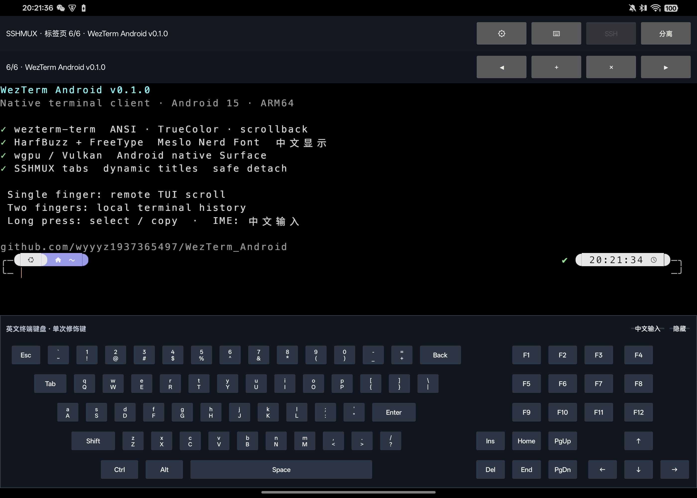
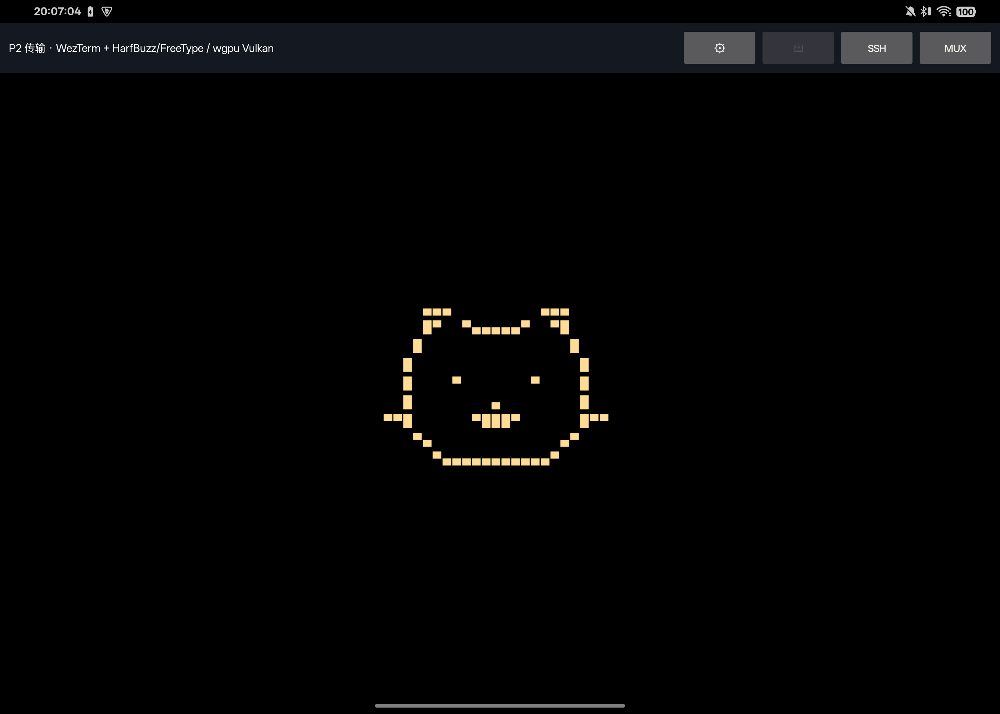
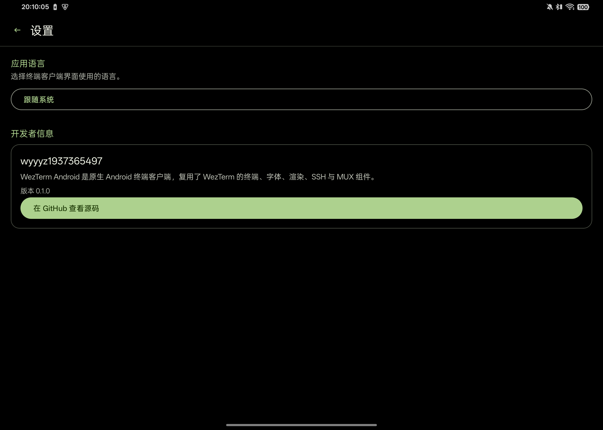

# WezTerm Android Native Client

一个实验性的 Android 原生 WezTerm 客户端前端：复用 WezTerm 的终端模型、字体底层、
字符渲染、SSH 与远程 mux 客户端代码，同时使用标准 Android Activity、SurfaceView、
输入法和系统服务。

它不依赖 X11、Wayland、Termux:X11、proot 或 Linux 桌面环境，也不是 WezTerm 官方
Android 发行版。

> 当前版本：`v0.2.3`。仅提供 `arm64-v8a` 调试签名 APK，已在
> Android 15 / API 35 真机完成核心功能验证，不应当作生产稳定版或正式密钥分发渠道。

## 应用截图

### SSHMUX、动态标题与固定终端键盘



| 无连接像素猫 | Material 3 设置页 |
|---|---|
|  |  |

## 已实现

- Android `SurfaceView` → JNI `ANativeWindow` → wgpu/Vulkan 原生渲染；
- `wezterm-term` ANSI/TrueColor/cell/scrollback 终端模型；
- MesloLGS Nerd Font Mono + 内置 Noto Sans Math + Android Noto Sans CJK fallback；
- 普通 SSH：host-key、认证、`xterm-256color` PTY、输入与 resize；
- SSHMUX：持久远端标签、新建/切换/关闭、安全 Detach、自动重附着和活动标签恢复；
- MUX 连接配置支持命名保存与下拉选择；预置 `乌邦图` 和 `Windows` 两套端点；
- 动态标签标题，跟随远端 pane/OSC title 更新；
- 每个远端标签独立记忆滚动位置，浏览历史时新输出不再推移视野；
- 设置页终端缩放：滑条调节单元格大小并实时预览行列网格，返回终端自动 resize；
- 单排紧凑顶部状态栏，最大化终端内容显示区域；
- 固定底部英文/符号/特殊键键盘，不覆盖终端 Surface；
- 独立系统 IME 输入框，支持自动换行、按 MUX 标签保存草稿并整串发送；
- 单指发送远端滚轮给 TUI，双指浏览本地历史；
- 长按选择、Android 浮动操作栏和系统剪贴板；
- 前后台 Surface 重建、失效连接识别和指数退避恢复；
- 纯黑终端、无连接像素猫、Material 3 深色界面；
- 跟随系统、English、简体中文以及设置页开发者信息。

## v0.2.3 更新

- MUX 连接对话框新增可编辑的配置下拉框与"保存配置"按钮，选择后自动填充
  主机、用户名、端口和远端 wezterm 路径；
- 首次升级把真机原有端点迁移为 `Windows`，并加入本机 `乌邦图` 配置；profile
  只保存连接参数，不保存密码或私钥。

## v0.2.2 更新

- 选择浮动菜单新增"保存"：把当前视口顶部经完整 scrollback 到实时光标行的内容
  一键导出为 `Downloads/wezterm-android-<时间戳>.txt`，导出后选择与菜单保持打开；
- SSHMUX 走绝对行号 `GetLines` RPC，从未在本地渲染过的历史行也能完整导出；
  本地 SSH 直接读取终端模型，锚点在 UI 线程捕获、RPC 等待与写盘在后台线程；
- release APK 改为构建时直接使用 debug 密钥签名，`assembleRelease` 产物可直接安装。

## v0.2.1 更新

- 修复 SSHMUX 下 Surface 重建后终端画面被本地占位内容覆盖的问题：强制缩放应用
  现在会使上一份 mux 快照失效并重新拉取真实远端窗格，而非渲染本地模型；
- Surface 重建时不再用本地占位画面更新交互状态：浏览历史后进设置再返回，
  滚动位置保持不变。

## v0.2.0 更新

- 设置页新增终端缩放：滑条调节单元格大小，预览区用白色网格线勾勒字符位置，
  返回终端后本地行列与远端 PTY/SSHMUX pane 自动同步 resize；
- SSHMUX 每个标签独立记忆滚动位置，切换标签（工具栏、自动重附、远端切换）自动恢复；
- 浏览历史时视口钉在绝对行，新输出在下方追加，不再把正在阅读的内容推出视野；
- 顶部两排控制按钮合并为一排，图标缩小，增大终端内容显示范围。

## v0.1.1 更新

- 补充内置 Noto Sans Math fallback，修复数学字母数字符号显示方框；
- 中文 IME 输入框支持自动换行、按 MUX 标签隔离草稿以及前后台持久恢复；
- 自动重附着和 Activity 恢复时重新聚焦离开前的远端 MUX 标签；
- Launcher 改用带黑色安全边距的 WezTerm 上游图标，避免 adaptive icon 裁切。

## 获取 APK

从 [GitHub Releases](https://github.com/wyyyz1937365497/WezTerm_Android/releases)
下载 `wezterm-android-v0.2.3-arm64.apk`。当前 Release 的工程边界是：

- 仅支持 `arm64-v8a`；
- release 构建变体 + cargo `--release` 原生库，使用 Android debug 密钥签名，并保留
  `debuggable` 以维持 `run-as` 免密身份导入工作流；
- 尚未接入 Android Keystore 和正式 release signing；
- 16 KB 页目前只有静态对齐检查，没有 16 KB 页设备运行证据。

## 本地构建

需要 Android SDK、NDK `28.2.13676358`、JDK、Rust stable、
`aarch64-linux-android` target 和 `cargo-ndk`。

```bash
rustup target add aarch64-linux-android
cargo install cargo-ndk --locked
./gradlew :app:assembleDebug
```

Gradle 会自动构建 ARM64 Rust JNI 库。APK 位于：

```text
app/build/outputs/apk/debug/app-debug.apk
```

安装并启动：

```bash
adb install -r app/build/outputs/apk/debug/app-debug.apk
adb shell am start -W -n com.example.wezterm_android/.MainActivity
```

## Debug 免密身份

需要 SSHMUX 调试时，可以为目标主机创建一把独立的 debug Ed25519 key，并放入应用
私有目录：

```bash
./scripts/provision-debug-identity.sh USER@HOST [ADB_SERIAL]
```

脚本首次运行可能询问一次远端密码。私钥不会进入 APK 或 Git；release 构建不会自动
使用它。不要将生成的身份文件作为正式用户密钥分发。

## 验证

Android 构建、JVM 测试和 Lint：

```bash
./gradlew :app:testDebugUnitTest :app:lintDebug :app:assembleDebug
```

Rust 终端、字体、SSH 与 MUX seam：

```bash
cargo test --manifest-path rust/Cargo.toml \
  -p wezterm-android-core \
  -p wezterm-android-font \
  -p wezterm-android-ssh \
  -p wezterm-android-mux \
  --locked -- --test-threads=1
```

真机原生日志：

```bash
adb logcat -s WezTermAndroid
```

## 当前边界

- 没有本地 PTY、本地 shell、本地 mux server 或桌面窗口兼容层；
- 普通 SSH 断线后不能恢复同一个 shell，持久任务应使用 SSHMUX；
- 复杂 Indic/ZWJ cluster、彩色 emoji、粗体/斜体 face 和链接交互待完善；
- Wi-Fi/蜂窝切换、Doze、长时间后台、横竖屏、分屏和更多 OEM 设备仍需压力回归；
- 当前是“进程存活则保持，连接失效或进程重启后自动重附着”，不是前台服务式无限
  后台保活；
- TLS domain、Android Keystore、密钥导入 UI、多 ABI 和正式签名尚未完成。

## 代码结构

```text
app/
  Android Activity、SurfaceView、键盘、手势、剪贴板、设置与本地化
rust/
  wezterm-android-native   JNI、ANativeWindow、wgpu 与生命周期协调
  wezterm-android-core     wezterm-term 和 TerminalSnapshot
  wezterm-android-font     HarfBuzz、FreeType、Meslo/数学/CJK 与 glyph atlas
  wezterm-android-ssh      普通 SSH 客户端
  wezterm-android-mux      SSHMUX client、标签与恢复
docs/
  ARCHITECTURE.md          当前目标与架构
  MAINTENANCE.md           开发历程、问题与维护方法
```

WezTerm 相关 Git 依赖统一固定在 revision
`d2f3f05b38f26a872f4b0bfbb3d2eaa7bdfc1b0b`，避免 terminal、mux、client 和 codec
之间产生版本漂移。
