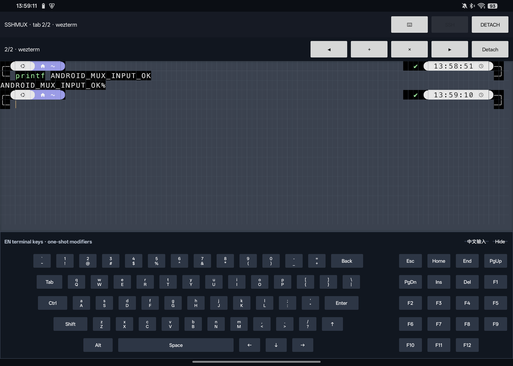

# P4-A：SSHMUX 持久远程客户端集成记录

日期：2026-09-07

## 结论

本阶段已完成真实 WezTerm SSHMUX 客户端链路及 Android 15 真机闭环：客户端复用
固定上游 revision 的 `wezterm-client`、`mux` 与 `codec`，可附着远端 mux、读取字符
快照、输入、切换/新建/关闭标签页，并能安全分离和重新附着而不终止远端 pane。

当前证据等级分开记录：

| 检查项 | 状态 | 证据边界 |
|---|---|---|
| 主机侧真实 SSHMUX 附着与字符快照 | PASS | 已连接 `10.126.126.10`，协商 codec 45 |
| 安全分离保留远端会话 | PASS | 分离前后仍为 `window=7/tab=31/pane=32` |
| 新建、前后切换、关闭测试标签页 | PASS | 仅对临时新建标签操作，清理后原 pane 保持不变 |
| Android ARM64 编译、JNI 导出与 APK 打包 | PASS | `cargo ndk check`、完整 assemble、JNI 符号和 16 KB 对齐检查通过 |
| Android 15 真机 SSHMUX 运行 | PASS | API 35 ARM64 真机通过应用私有 Ed25519 密钥附着、渲染、输入和标签操作 |
| Android 端安全分离与重新附着 | PASS | 分离后原 `pane=32` 保持，随后重新附着到同一 pane |
| 固定键盘与远端尺寸同步 | PASS | Surface 与键盘边界相接且不重叠，远端稳定为可见的 `101x17` |
| 同进程 Detach 后再次附着 | PASS | 修复 promise scheduler 交接后，在 PID `15528` 内连续完成 Detach→Attach |
| 跨应用后台与前台热恢复 | PASS | 修复后设置↔客户端 3 轮，PID 均为 `20458`，每轮 renderer 重建并保持 `SSHMUX 1/1` |
| 进程结束后的冷启动重附着 | PASS | force-stop 已验证自动恢复；修复版安装后 PID `20458` COLD 启动亦自动附着并 present |
| 固定键盘 Resize 压力 | PASS | 隐藏/显示 3 轮，本地 Surface 与远端 pane 均逐轮同步为 `101x30` / `101x17` |

## 实现结构

```text
MainActivity 固定布局
  ├─ 顶部状态栏：SSH / MUX / 键盘开关
  ├─ SSHMUX 工具栏：上一页 / 新建 / 关闭 / 下一页 / 安全分离
  ├─ 加权 Terminal Surface
  └─ 固定底部终端键盘
                ↓ JNI
wezterm-android-native
  ├─ 普通 SSH 与 SSHMUX 会话互斥
  ├─ Surface、输入和远端会话生命周期解耦
  ├─ Android 应用私有 HOME/XDG 路径适配
  └─ 同一 TerminalSnapshot / wgpu 渲染入口
                ↓
wezterm-android-mux
  ├─ 独立线程持有上游全局 Mux 与 promise scheduler
  ├─ 可重入运行时交接与旧 scheduler 消息排空
  ├─ ClientDomain(Ssh) / codec 45
  ├─ ClientPane -> TerminalSnapshot
  └─ attach / resize / write / tabs / spawn / close / detach
```

Android 不创建本地 PTY、本地 shell 或本地 mux daemon。`ConnectionUI` 只承担上游
附着流程；当前移动端 SSHMUX 模式要求应用私有密钥已经可用，且主机密钥已通过普通
SSH 流程写入同一个应用私有 `known_hosts`。

上游 `config` 初始化依赖 `dirs-next` 提供 HOME。Android 应用 UID 没有传统 Unix
passwd HOME，因此项目为 `dirs-next` 增加 Android 专用后端，并在 JNI 启动 SSHMUX
前把 HOME、cache、config、data 和 runtime 映射到应用私有目录；没有修改进程级
`HOME` 环境变量。运行线程同时捕获 panic 并把错误转换为 Android 可见事件，避免
原生线程静默退出。

## 安全分离与关闭标签页

两种操作在代码和 UI 中严格分开：

- **Detach**：先调用 `ClientDomain::detach`，使 domain 进入 `Detached`，再清理本地
  pane 镜像和运行线程。上游 `ClientPane::kill` 在 detached 状态不会发送
  `KillPane` RPC，因此远端进程继续运行。
- **Close tab**：显式从 mux 删除当前 tab，其 pane 会发送远端 `KillPane`。Android
  UI 在调用前显示不可绕过的破坏性语义确认。

主机实连测试先记录远端对象为 `window=7/tab=31/pane=32`，附着并取得
`254x59` 字符快照后安全分离；随后再次列出仍是同一组对象。标签控制测试只新建
一个临时远端 tab，验证前后切换后关闭该临时 tab，最终仍只保留原对象。

Android 真机回归再次附着原对象，创建临时 `tab=36/pane=37`，在该临时 pane 中
通过 Android 输入链路执行并显示 `ANDROID_MUX_INPUT_OK`。UI 的上一页/下一页分别
显示 `1/2` 与 `2/2`，关闭确认后远端重新只剩原 `pane=32`。点击 Detach 后 UI 显示
“remote tabs preserved”，远端对象未变；随后再次附着仍回到同一 `pane=32`。

## 生命周期、自动重附着与卡住问题

Activity 与远端会话采用两层恢复语义：

- `onStop` 只停止 UI 轮询和尚未执行的重试计时，不调用 Detach。Android 进程仍在时，
  Surface 可销毁重建，而 SSHMUX runtime、连接和远端 pane 保持；
- 一次附着成功后，客户端保存端点并开启自动重附着标志。进程被系统结束，或前台
  连接报错时，客户端用应用私有 Ed25519 身份重新启动 SSHMUX，失败按
  1/2/4/8/15/30 秒退避；
- 用户点击 **Detach** 属于显式意图，会清除该标志，不会被自动连接抵消。

首次实现同进程 Detach→Attach 时，第二次附着会停在 “authenticating and negotiating
codec”。网络、密钥和远端进程实际上都正常。对挂起进程执行 native backtrace 并用
NDK 符号解析后，阻塞栈为：

```text
std::Mutex::lock_contended
  -> promise::spawn::set_schedulers
  -> wezterm_android_mux::run_runtime
```

根因是上游进程全局 promise scheduler 在持有内部互斥锁时调用旧调度回调；旧 runtime
的接收端已销毁，晚到 runnable 在发送失败/析构时递归触发调度，锁无法交给第二个
runtime。修复后，Stop 顺序改为 Detach domain、关闭全局 Mux、清除 active 标志并确认
停止，同时保留旧 receiver 排空晚到消息；只有新 runtime 安装两条新 scheduler 后，旧
receiver 才结束。`Drop` 等待停止确认，但不 join 这个交接线程，避免把交接本身变成
环形等待。

修复版在同一 PID 内完成分离和第二次 codec 45 附着；随后又分别通过 HOME 热恢复和
强制结束进程后的 COLD 启动自动附着。

后续跨应用复查发现，早期“热恢复 PASS”只检查了 PID 与 SSHMUX 状态栏，遗漏了 GPU
Surface 是否真的恢复。native 日志显示部分切回会出现：

```text
native_window_api_connect() failed: Invalid argument (-22)
nativeSurfaceCreated panicked
```

这是第二个独立问题。`nativeSurfaceCreated` 当时先把 renderer 放入全局槽，再用 `?`
发送远端 Resize；若网络侧 Resize 暂时失败，JNI 会返回 `false`，但 renderer 仍实际
持有 `ANativeWindow`。Kotlin 因而把本地状态记为未附着，并在 `surfaceDestroyed` 时跳过
清理；下一次 `surfaceCreated` 又让 Vulkan 连接同一个 producer，最终得到 `-22`。旧的
`nativeSurfaceChanged` 还会在 GPU Resize 失败后继续发送远端尺寸，使画面与 pane 行列
进一步失步。

当前修复把这三个边界拆开：

- 新 Surface 创建前无条件取出并 drop 旧 renderer，保证旧 producer 先断开；
- renderer 创建成功后，远端 Resize 失败只记录警告，不再把 Surface 回报为失败；
- `surfaceDestroyed` 无条件调用幂等 native 清理；`surfaceChanged` 返回 GPU 成功状态，
  仅在成功后同步远端，失败则先 drop renderer、待回调退出后重新附着。

修复版安装后以 PID `20458` COLD 启动，自动附着 `SSHMUX 1/1`，初始 Surface 从
`101x33` 随固定键盘稳定 Resize 为 `101x17`。随后键盘隐藏/显示连续 3 轮，本地 Vulkan
Surface 和远端 pane 每轮均精确切换 `101x30 ↔ 101x17`。再连续 3 轮打开 Android 设置
并返回，PID 均未变化，每轮日志完整出现 `surfaceDestroyed → released ANativeWindow →
configured native surface 2800x932 → P1-B ready`；最终远端内容、光标与键盘实际可见，
没有 `-22`、Surface panic 或 SSHMUX 重建。

随后又确认了第三个独立边界：某些跨应用切换会让上游 `ClientDomain` 进入
`not attached`，但 JNI 中的 session handle 与 `MUX_READY` 仍然保留。旧实现因此继续
显示 `DETACH`，每 100 ms 快照均失败，重建 Surface 只显示空闲像素猫。当前实现会把
首次快照失败转换为一次性的 `MuxEvent::Error`，立即清除 ready 状态，在 UI 线程之外
安全分离失效 runtime，再按已有策略自动重附着；同时 Surface 销毁会使上一张 mux
快照缓存失效，新 Surface 必须完整重绘。Android 设置与客户端往返两轮均在同一 PID
内得到“1 次失败检测、1 次安全分离、1 次重新附着”，最终恢复原 `tab 1/2`，没有
错误风暴或像素猫残留。

## 输入、尺寸与布局

普通 SSH 和 SSHMUX 共用现有键盘入口：英文/符号/特殊键写入 active pane，中文在
独立系统 IME 编辑框完成组合后一次性提交 UTF-8。SSHMUX 切换 tab 后会将当前
Android Surface 对应的行列与像素尺寸发送给新 active pane。

状态栏、SSHMUX 工具栏、终端 Surface 和底部键盘都是同一个纵向布局中的普通子
View；终端使用剩余高度，任何工具栏或键盘都不覆盖字符行。Android 15 的系统栏、
刘海和系统 IME 仍通过 `WindowInsets` 缩小根布局。

本轮横屏分辨率为 `2800x2000`：SSHMUX 工具栏结束于 `y=334`，终端 Surface 为
`[0,334]–[2800,1266]`，固定键盘为 `[0,1266]–[2800,1960]`，二者边界精确相接。
键盘显示后本地和远端最终均为 `101x17`。回归还发现并修复了附着初始全高尺寸与
键盘收缩尺寸的异步 RPC 竞争：正常更新本地 tab 树后，再显式发送最终 Android
Surface 尺寸，使服务端不会回跳到旧行数。



## 构建与校验

- Rust 主机测试：terminal/font/ssh/mux 共 25 个测试串行通过；
- Kotlin/JVM：5 个终端键盘规格测试通过；
- `aarch64-linux-android` 全依赖图检查通过；
- debug APK 完整构建成功，包含 `arm64-v8a/libwezterm_android.so`；
- ELF 仅依赖 Android NDK 系统库，没有 X11、XCB、Wayland 或 D-Bus；
- ELF `LOAD` 段与 APK zip entry 的 16 KB 对齐检查通过。

遵循项目约定，本阶段没有计算或生成 SHA-256。

## 尚未完成

- SSHMUX 首次主机信任和密码/交互式认证尚未桥接到 Android 对话框；当前应先用
  普通 SSH 完成 host-key 信任，并使用应用私有密钥；
- 前台故障重试和进程重启自动重附着已完成；TLS domain、Android Keystore、前台
  服务式长期后台保活以及 Wi-Fi/蜂窝/Doze 压力仍属于后续工作；
- 本轮验证的是 Android 15 横屏；横竖屏切换、分屏和系统 IME Insets 仍需单独做
  生命周期压力回归；
- 目前只显示每个 tab 的 active pane，尚无移动端 pane 分割选择 UI。
